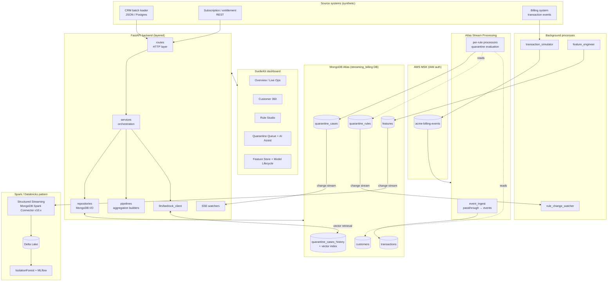
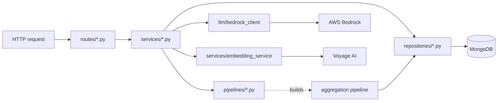
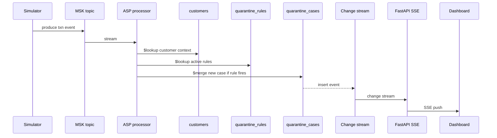
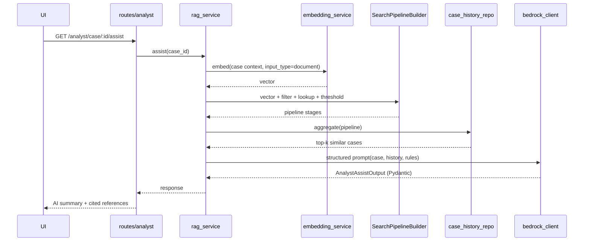
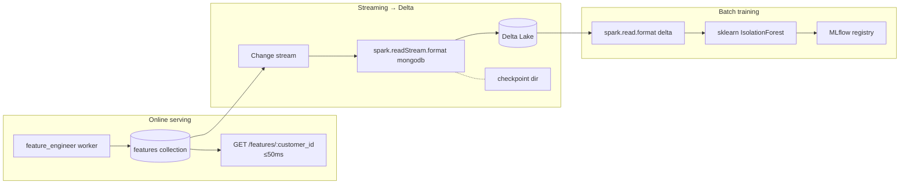

# Architecture — Streaming Billing

## System overview

## Layering — backend

**Rules of the road:**

- Routes never call repositories or build pipelines.
- Services never call PyMongo or Bedrock SDKs directly.
- Pipelines never execute — they only construct stages.
- Workers never share the FastAPI event loop.

## Quarantine evaluation flow (Pillar 2)

## RAG analyst flow (Pillar 3)

## Feature store + Spark Streaming (Pillar 4)

The streaming and batch paths are intentionally decoupled. Feature freshness
is measured in seconds; training cadence is independent (scheduled or
drift-triggered).

## Collection map

| Collection | Purpose | Key indexes |
|---|---|---|
| `customers` | Unified customer view (profile + active subs + active promotions + entitlements) | `customer_id` (unique); Atlas Search index on `name`, `ic_number`, `account_id` |
| `transactions` | Full transaction history (referenced from customers) | `customer_id + timestamp`, `transaction_id` (unique) |
| `quarantine_rules` | Asymmetric rule documents (polymorphic by `rule_type`) | `enabled + mode`, `rule_type`, `name` (unique) |
| `quarantine_cases` | Live cases pending or resolved | `created_at` desc, `customer_id`, `status + severity` |
| `quarantine_cases_history` | Resolved-cases corpus for RAG | `_id`; Atlas Vector Search index on `embedding` (1024-d, cosine); metadata fields `rule_types_triggered`, `disposition`, `customer_segment` |
| `features` | Engineered features for online serving + Spark streaming source | `customer_id` (unique); `updated_at` for streaming watermark |
| `crm_snapshots` | Simulates the Redshift batch refresh (CRM lag toggle reads from this) | `as_of` desc |

## Index definitions

See `infra/atlas-setup.md` for full Atlas Search and Atlas Vector Search index
JSON definitions.
